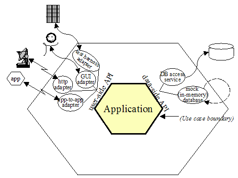
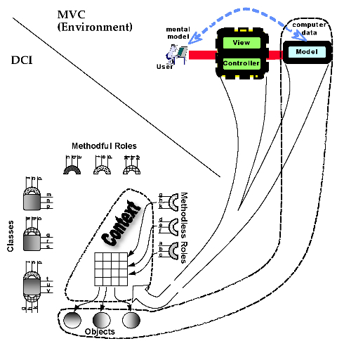
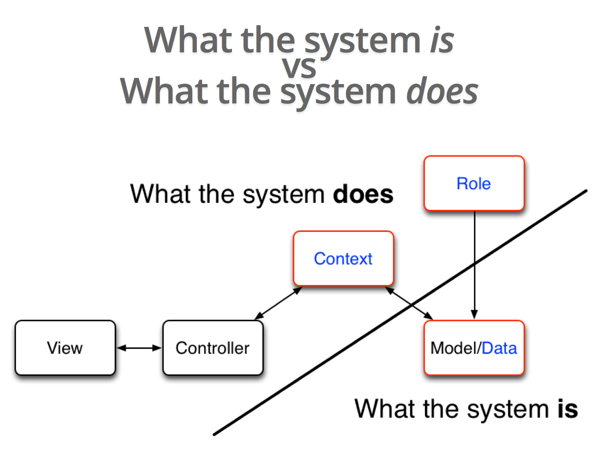

Software Architecture Design  
========  

Software Architecture Design，是一个很大的话题，也是每位工程师应该长期实践和思考，耳熟能详的：六边形架构、洋葱架构、三层架构、CQRS、DDD 都属于其的范畴。与之相关的还有一个话题：[Architectural Pattern](https://en.wikipedia.org/wiki/Architectural_pattern)。

架构学习有这几个非常好的学习资料：  

- [Linux/Unix设计思想](http://www.amazon.cn/gp/product/B007PYVKLC)  
- [Software Architecture Patterns](http://www.oreilly.com/programming/free/software-architecture-patterns.csp)  
- [The Architecture of Open Source Applications](http://www.aosabook.org/en/index.html)  
- [MSDN-Software Architecture and Design](https://msdn.microsoft.com/en-us/library/ee658093.aspx)  
- [Design pattern samples in Java](http://java-design-patterns.com/)  

个人感觉还是从：数据+算法、Input -> Processor -> Output 的维度去思考系统更简洁。内容会持续补充...

### 经典架构

在 [The Four Architectures that will inspire your programming](http://andrzejonsoftware.blogspot.no/2013/12/the-four-architectures-that-will.html) 这篇文章中，作者介绍了介绍了四种经典架构：  

- [The Hexagonal Architecture](http://alistair.cockburn.us/Hexagonal+architecture)  
- [The Clean Architecture](http://blog.8thlight.com/uncle-bob/2012/08/13/the-clean-architecture.html)  
- [DDD(Domain-driven design)](https://en.wikipedia.org/wiki/Domain-driven_design)/[CQRS](http://martinfowler.com/bliki/CQRS.html)  
- [DCI: Data Context Interaction](https://en.wikipedia.org/wiki/Data,_context_and_interaction)  

另一篇文章：[4 Great Programming Architectures You should Know](http://codecall.net/2014/01/28/4-great-programming-architectures-you-should-know/) 中也提到了这四种架构。

### DDD  

DDD 是 大神Eric Evans 于 2004 创立的一种软件设计和实现方式，至今仍非常火。它将软件开发分为两个阶段：  
- 以一种领域专家、设计人员、开发人员都能理解的通用语言作为相互交流的工具，在交流的过程中发现领域概念，然后将这些概念设计成一个领域模型；
- 由领域模型驱动软件设计，用代码来实现该领域模型；

个人感觉 DDD 更像是一种业务分析方法，帮助我们将业务需求转化为系统设计，并确立系统各个模块的职责和相互之间的交互机制，对做业务架构非常有帮助。

**快速了解：**  

- [An Introduction to Domain Driven Design](http://www.methodsandtools.com/archive/archive.php?id=97)  
- [领域驱动设计和实践](http://kb.cnblogs.com/page/112298/)  
- [Domain Driven Design Quickly](http://www.infoq.com/cn/minibooks/domain-driven-design-quickly)  
- [DDD领域驱动设计基本理论知识总结](http://www.cnblogs.com/netfocus/archive/2011/10/10/2204949.html) 作者的 blog 中有不少 DDD 相关的文章  
－ [Domain-Driven Design in an Evolving Architecture](http://www.infoq.com/articles/ddd-evolving-architecture)  

**经典书籍**  

- [[PDF]Domain-Driven Design: Tackling Complexity in the Heart of Software - Eric Evans](http://www-public.tem-tsp.eu/~gibson/Teaching/CSC7322/ReadingMaterial/Evans03.pdf)  
- [[PDF]Implementing Domain-Driven Design - Vaughn Vernon](http://ptgmedia.pearsoncmg.com/images/9780321834577/samplepages/0321834577.pdf)  

在讨论 DDD 时，经常会听到：贫血模型、充血模型这两个概念，这里是一些相关资料：  
- [Anemic Domain Model - 贫血领域模型](http://www.martinfowler.com/bliki/AnemicDomainModel.html)  
- [Rich Domain Model - 充血模型](http://www.slideshare.net/chris.e.richardson/building-rich-domain-models)  
- [The Anaemic Domain Model is no Anti-Pattern, it’s a SOLID design](https://blog.inf.ed.ac.uk/sapm/2014/02/04/the-anaemic-domain-model-is-no-anti-pattern-its-a-solid-design/)  反击文 [Rich Domain Is SOLID , Anaemic Domain Is An Anti Pattern](http://blog.sapiensworks.com/post/2014/03/26/Rich-Domain-Is-SOLID-Anaemic-Domain-Is-An-Anti-Pattern.aspx/)
- [贫血，充血模型的解释以及一些经验](http://kb.cnblogs.com/page/520743/)  需要注意这篇文章对贫血模型的定义和标准的不一样
- [领域模型、贫血模型、充血模型概念总结](http://blog.csdn.net/zsy_gemini/article/details/9060105)  
- [关于架构设计的“贫血模型”与“充血模型”](http://www.cnblogs.com/magiccode1023/archive/2012/11/06/2756234.html)  
- [贫血模型or充血模型新的解决办法](http://www.iteye.com/topic/1114441)  

与 DDD 相关的还有一个概念：[四色原型](https://en.wikipedia.org/wiki/Object_Modeling_in_Color)。

### Hexagonal Architecture - 六边形架构  

由 Alistair Cockburn 在 2005 年提出：  
- 原文：http://alistair.cockburn.us/Hexagonal+architecture  
- 译文：http://blog.csdn.net/zhongjinggz/article/details/43889821  

这位大神非常高产，是 Agile Movement 的发起者之一，兴趣广泛，他有一篇文章还引用了汉字去解释它的观点：[守 – 破 – 離 – 心](http://alistair.cockburn.us/Shu+Ha+Ri)，很有意思。

这个架构很容易理解，也衍生出了多种变种，看 Intent、Motivation、Nature of the Solution  三节即可了解其思想，对组织代码、拆分系统非常有帮助，跟 Coding 强相关，即学即用，不容错过。它借鉴了 OS 中端口、设备的概念，通过识别一个系统中核心业务、外围实体，区分去可变和不可变成分。个人感觉感觉是对  Input -> Processor -> Output  的再深化。其中有两个重要概念：  

- PORT：应用对外部呈现的一组 API，对一类业务逻辑的封装  
- Adapter：实现 API 和外围实体的桥接

其难点在于：如何定义好编辑并识别 PORT。我的理解是：首先识别出应用自身（我的核心职责是什么）、服务方（外界通过什么服务来使用我）、依赖方（我依赖的服务），服务方、依赖方分别对应 port 和外围。

相关资料：  
- http://fideloper.com/hexagonal-architecture  
- http://c2.com/cgi/wiki?HexagonalArchitecture  
- http://culttt.com/2014/12/31/hexagonal-architecture/  
- http://www.infoq.com/news/2014/10/exploring-hexagonal-architecture  
- http://spin.atomicobject.com/2013/02/23/ports-adapters-software-architecture/  
- http://geekswithblogs.net/cyoung/archive/2014/12/20/hexagonal-architecturendashthe-great-reconciler.aspx  

### The Onion Architecture  

  

由 Jeffrey Palermo (Managing Partner/CEO, Microsoft MVP each year since 2006) 提出，原文：   http://jeffreypalermo.com/blog/onion-architecture-part-4-after-four-years/  

Key tenets of Onion Architecture:  
- The application is built around an independent object model
- Inner layers define interfaces.  Outer layers implement interfaces
- Direction of coupling is toward the center
- All application core code can be compiled and run separate from infrastructure  

这个架构很容易理解，和六边形架构一脉相承，作者希望解决分层架构带来的一些问题，同时给大家提供一套标准的的模型和语言去描述系统。由于理念很清晰而且实战性很强，基本无太多争议，被广泛应用。

相关资料：  

- [Domain-Driven Design with Onion Architecture](http://www.infoq.com/news/2014/10/ddd-onion-architecture)  
- [Chop Onions Instead of Layers in Software Architecture](http://www.methodsandtools.com/archive/onionsoftwarearchitecture.php)  
- [Onion Architecture](https://sbrakl.wordpress.com/2014/11/18/onion-architecture/)  

### The Clean Architecture  

由 Uncle Bob （原名 Robert C. Martin，The Clean Coder 作者） 提出的一种架构：  
- 原文： http://blog.8thlight.com/uncle-bob/2012/08/13/the-clean-architecture.html  
- 译文： http://www.cnblogs.com/yjf512/archive/2012/09/10/2678313.html  
- 视频： https://www.youtube.com/watch?v=Nltqi7ODZTM

这位大叔写了很多文章，涉及我们日常听到的各种术语，这类是他的一些资源：
- 文章汇总： https://blog.8thlight.com/uncle-bob/archive.html  
- GitHub： https://github.com/unclebob  

它总结了多种架构的特点，抽象出其共性：  
- Independent of Frameworks. The architecture does not depend on the existence of some library of feature laden software. This allows you to use such frameworks as tools, rather than having to cram your system into their limited constraints.
- Testable. The business rules can be tested without the UI, Database, Web Server, or any other external element.
- Independent of UI. The UI can change easily, without changing the rest of the system. A Web UI could be replaced with a console UI, for example, without changing the business rules.
- Independent of Database. You can swap out Oracle or SQL Server, for Mongo, BigTable, CouchDB, or something else. Your business rules are not bound to the database.
- Independent of any external agency. In fact your business rules simply don’t know anything at all about the outside world.

这种架构可以看作六边形架构的衍生，和 The Onion Architecture 有异曲同工之妙 对组织大型应用很有参考价值，也有很多语言在实践。

相关资料：  
- [Obvious - A clean software architecture](http://retromocha.com/obvious/)  
- [Clean Architecture](https://subvisual.co/blog/posts/20-clean-architecture)  
- [Clean Architecture in Ruby - v2](https://medium.com/@fbzga/clean-architecture-in-ruby-v2-d2293c78d4a6#.wz4js826z)  

### CQRS  

  

CQRS 由  Greg Young 提出，见文档 [CQRS Documents by Greg Young](https://cqrs.files.wordpress.com/2010/11/cqrs_documents.pdf)，视频 [Greg Young - CQRS and Event Sourcing](https://www.youtube.com/watch?v=JHGkaShoyNs)。思想很容易懂，是值得认真研究和掌握的一种架构，用的好的话对提高系统性能非常有帮助。

这里有大神 Martinfowler 的介绍：  
- 原文： http://martinfowler.com/bliki/CQRS.html  
- 译文： http://www.tuicool.com/articles/7BVjie  

[Martinfowler](http://www.martinfowler.com/) 是系统设计领域的大师，ThoughtWorks 的首席科学家，有非常多的文章在流传，他的网站干货满满。 

相关资料：  
- [CQRS, Event Sourcing, and Domain Driven Design FAQ](http://cqrs.nu/)  
- [CQRS revisited](https://lostechies.com/gabrielschenker/2015/04/07/cqrs-revisited/)  
- [When NOT to use CQRS?](https://abdullin.com/post/when-not-to-use-cqrs/) 比较难得的是这是 [Lokad.CQRS Framework](http://lokad.github.io/lokad-cqrs/) 的作者实践后给出的建议  
- [Types of CQRS](http://enterprisecraftsmanship.com/2015/04/20/types-of-cqrs/)  
- [对CQRS的一次批判性思考](http://www.infoq.com/cn/news/2015/07/cqrs-critical-view)  
- [CQRS的益处](http://www.infoq.com/cn/news/2015/05/cqrs-advantages)  
- [CQRS is too complicated](http://codeofrob.com/entries/cqrs-is-too-complicated.html)  
- [浅谈命令查询职责分离(CQRS)模式](http://www.cnblogs.com/yangecnu/p/Introduction-CQRS.html)  
- [Clarified CQRS](http://udidahan.com/2009/12/09/clarified-cqrs/) [译文](http://liuzhaodong89.iteye.com/blog/1930310)  

### DCI  

  

  

理论派的典范，由 and James O. Coplien 提出：  
- 原文：http://www.artima.com/articles/dci_vision.html  
- 视频：https://www.youtube.com/watch?v=SxHqhDT9WGI  

两位创始人都是软件架构领域神级人物：  
- [James O. Coplien](https://sites.google.com/a/gertrudandcope.com/www/jimcoplien) - The father of Organizational Patterns  ［Multi-Paradigm Design](https://sites.google.com/a/gertrudandcope.com/info/Publications/Mpd/Thesis.pdf?attredirects=0) 的作者，这本书试图深入探究 software abstraction and design 并回答： What is a paradigm? What is the relationship between analysis, design, and implementa- tion? 
- [Trygve Reenskaug](http://folk.uio.no/trygver/) -The inventor of the MVC pattern  

而 DCI 正是为了解决 OO 及 MVC 存在的一些问题而提出的，它从这两种模型的思想根源来深入剖析其存在的问题，并推演出改进方案。被广泛关注，以 Ruby、Java 为典型代表。由于挑战的是两大经典模型，所以引发很多讨论。这篇文章对理解 GUI、OO、MVC 非常有帮助，但真的挺难懂的。这是他们对 OO 的解读：  

- The goal of object-oriented programming pioneers was to capture end user mental models in the code. 
- When a user approaches a GUI, he or she does two things: thinking and doing. For a smooth interaction between man and machine, the computer's "mental" model (also the programmer's mental model) and the end user's mental model must align with each other in kind of mind-meld. In the end, any work that users do on their side of the interface manipulates the objects in the code.  
- Object-oriented programming was supposed to unify the perspectives of the programmer and the end user in computer code: a boon both to usability and program comprehension. 
- Object orientation hasn't fared so well to capture how we reason about doing. **There is no obvious "place" for interactions to live, either on the GUI or in the code.**
- Programmers are people, too, and we want them to be able to map from their understanding of user needs to their understanding of the code. Object-oriented programming languages traditionally afford no way to capture collaborations between objects. They don't capture algorithms that flow over those collaborations.

创始人眼中的 MVC 是这样的：  

  

这是他对 MVC 的部分解读：  

- MVC's goal was to provide the illusion of a direct connection from the end user brain to the computer "brain"—its memory and processor. MVC is about people and their mental models—not the Observer pattern.
- Data are the representation of information. The mind of the end user can interpret these data; then they become information. Information is the term we use for interpreted data. Information is a key element of the end user mental model. A well-designed program does a good job of capturing the information model in the data model, or at least of providing the illusion of doing so. If the software can do that then the user feels that the computer memory is an extension of his or her memory.
- The job of the model is to "filter" the raw data so the programmer can think about them in terms of simple cognitive models.
- The View displays the Model on the screen. View provides a simple protocol to pass information to and from the Model. The heart of a View object presents the Model data in one particular way that is of interest to the end user.
- The Controller creates Views and coordinates Views and Models. It usually takes on the role of interpreting input user gestures, which it receives as keystrokes, locater device data, and other events. 
- Model-View-Controller-User: it does a good job of supporting the thinking part of computer/human interaction. 

OO 和 MVC 存在的问题：  

- We can trace much of our failure to capture the end user mental model of doing to a kind of object mythology. Some buzzwords of this mindset included anthropomorphic design, smart objects, and emergent system behavior. We were taught that system behavior should "emerge" from the interaction of dozens, hundreds or thousands of local methods. The word of the day was: think locally, and global behavior would take care of itself.
- The MVC framework makes it possible for the user to reason about what the system is: the thinking part of the user cognitive model. But there is little in object orientation, and really nothing in MVC, that helps the developer capture doing in the code. The developer doesn't have a place where he or she can look to reason about end user behavioral requirements.  
- The algorithm had to be distributed across the objects, because to have a large method that represented an entire algorithm was believed to not be a "pure" object-oriented design. How did we decide to split up the algorithm and distribute its parts to objects? On the basis of coupling and cohesion. Algorithms (methods) had to be collocated with the object that showed the most affinity for the algorithm: optimizing cohesion. 
- Interesting business functionality often cuts across objects. Object-orientation pushed us into a world where we had to split up the algorithm and distribute it across several objects, doing the best piecemeal job that we could. 

DCI 的三个核心概念：  

- Data: representing the user's mental model of things in their world  
- Roles: a (not so) new concept of action that also lives in users' heads. objects capture what objects are, roles capture collections of behaviors that are about what objects do. At their heart, roles embody generic, abstract algorithms. They have no flesh and blood and can't really do anything. 
- Interactions that weave their way through the roles are also not new to programming: we call them algorithms, and they are probably the only design formalism that predates data as having their own vocabulary and rules of thumb.

这三个是独立于编程语言的概念，DCI 试图在编程语言层面找到这几个概念的具体表现。

DCI 的架构理念：  

- The data, that live in the domain objects that are rooted in domain classes;
- The context that brings live objects into their positions in a scenario, on demand;
- The interactions, that describe end-user algorithms in terms of the roles, both of which can be found in end users' heads.

感觉 DCI 更像是一种软件分析方法同时配合了如何用 OO 去实现，和具体怎么 coding 相关，不像是系统架构。DCI 试图寻找一种方式帮助我们完成真实世界和代码世界的映射，使得在代码中不仅仅能看到数据，也能看到用户在使用应用过程中的真实行为。它试图在 OO 和数据结构+算法的模型寻求平衡，引入函数式编程的概念来解决 OO 中存在的一些问题。偏理论+学术化，对 DDD 中 Application Core 如何设计有借鉴意义。

相关资料：  

- [Data Context Interaction: The Evolution of the Object Oriented Paradigm](http://www.sitepoint.com/dci-the-evolution-of-the-object-oriented-paradigm/)  
- [DCI Documentation](http://folk.uio.no/trygver/themes/babyide/baby-documents.html)  
- [DCI - The End User Architecture](http://mikepackdev.com/dci) 讲得比较清晰  
- [DCI: Re-thinking the foundations of object orientation and of programming](http://oredev.org/videos/dci--re-thinking-the-foundations-of-oo)  
- [FullOO](http://fulloo.info/)  专门介绍 DCI 及其实践  
- [DCI in Ruby](http://dci-in-ruby.info/) 作者 [Victor Savkin](http://victorsavkin.com/)  是 Angular team 成员，研究多种语言  
- [DCI: The Right Idea for the Wrong Paradigm](https://tonyarcieri.com/dci-in-ruby-is-completely-broken)  
- [DCI Architecture – Good, not Great, or Both?](http://pettermahlen.com/2010/09/10/dci-architecture-good-not-great-or-both/)  
- [DCI架构是什么](http://www.jdon.com/37976)  
- [DCI和DDD学习笔记整理](http://www.cnblogs.com/know/archive/2011/11/09/2242312.html)  
- [Implementing DCI in Qi4j](http://www.jroller.com/rickard/entry/implementing_dci_in_qi4j)  

说到 OO，相关的还有：  

- [Role-oriented programming](https://en.wikipedia.org/wiki/Role-oriented_programming)  
- [Aspect-oriented programming](https://en.wikipedia.org/wiki/Role-oriented_programming)  
- [Subject-oriented programming](https://en.wikipedia.org/wiki/Subject-oriented_programming)  
- [Data-driven programming](https://en.wikipedia.org/wiki/Data-driven_programming)  

OO 衍生出很多概念、模式，有时候不由得让人会想：需要搞这么复杂吗？已经有一些高人跳出来试图简化概念和术语，让大家能用简单一致的语言交流和编写代码。函数式编程也正在渐渐兴起，有很多人更认为这是编程的未来。还是 对编程模式有兴趣的同学可以顺着这个话题去研究：[Programming Paradigm](https://en.wikipedia.org/wiki/Programming_paradigm)

### Ext 

#### Java 实践  

**Apache Zest**  
http://zest.apache.org/  
Apache Zest™ is a community based effort exploring Composite Oriented Programming for domain centric application development. This includes evolved concepts from Aspect Oriented Programming, Dependency Injection and Domain Driven Design. Composite Oriented Programming allows developers to work with 'fragments', smaller than classes, and 'compose' fragments into larger 'composites' which acts like the regular objects.

**Design pattern samples in Java**  
http://java-design-patterns.com/  
Design patterns are formalized best practices that the programmer can use to solve common problems when designing an application or system. Design patterns can speed up the development process by providing tested, proven development paradigms.

#### JavaScript 实践

[What the Flux? (On Flux, DDD, and CQRS)](http://jaysoo.ca/2015/02/06/what-the-flux/)  
[Domain-Driven JavaScript Development](http://www.slideshare.net/bobholt/ddd-17779078)  
[Building JavaScript applications based on DDD, CQRS and EventSourcing](http://www.slideshare.net/jbsen/mvc-evolved)  
[Microservices in Node.js using Event Sourcing and CQRS](http://slides.com/stefankutko/nodejs-microservices-event-sourcing-cqrs)  

**cqrs-domain**  
http://cqrs.js.org/pages/domain.html  
https://github.com/adrai/node-cqrs-domain  
Node-cqrs-domain is a node.js module based on nodeEventStore that. It can be very useful as domain component if you work with (d)ddd, cqrs, eventdenormalizer, host, etc.

**DDD-CQRS-Actor framework for javascript**  
https://github.com/liangzeng/cqrs  

**eventstore**  
https://github.com/adrai/node-eventstore  
Node-eventstore is a node.js module for multiple databases. It can be very useful as eventstore if you work with (d)ddd, cqrs, eventsourcing, commands and events, etc.
